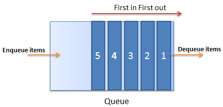

# ADTs  

## Motivation 

## Stacks & Queues

Queue: First in, first out

Stack: Last in, first out

## Nodes & Trees

class Node
@value
@children #=> []

## DFS & BFS
- Depth-First Search
    - Start at the root node
    - Check one child, which recursively checks it's first child
    - Move on to other children after checking all the way deep down the tree

- Breadth-First Search
